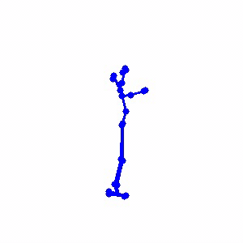
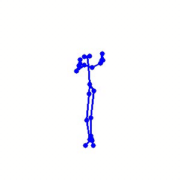
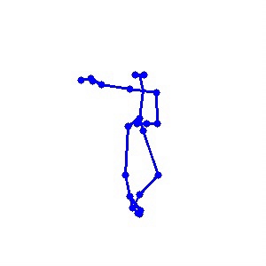

# Music-oriented human motion generation with GANs

The dataset comes from [Music-to-Dance-Motion-synthesis](https://github.com/Music-to-dance-motion-synthesis/dataset). It is composed of 3D motion capture of choreographies along with audio track (~90min). There are four types of dance, waltz, cha-cha, tango & rumba.

:grey_exclamation: The dataset is corrupted. Waltz sequences are 4 times slower and need to be interpolated. Plus, audio and stick sequences are not synchronized. To be continued.

  

## Implementation of WGANs to generate stick figures

Dance as motion capture is simply a sequence of stick frames : the skeleton is the building block of motion capture. Therefore prior to motion generation, we focus in this section on still pose generation by means of generative adversarial networks (in Wasserstein GP setting).

Here a residual fully-connected network is used to generate those samples. The architecture is as follows :

  

 

Here are generated samples :

## Implementation of WGANs to generate dance sequences

The following framework is built upon the assumption that generative adversarial networks can be trained in a sequential manner to generate human motion sequences whose "choreographic realism" (meaning smoothness and syntax) equates to or overtakes those of classic motion-regression deep models while allowing diversity.

Indeed, solving human motion generation using regression suffers from several deficiencies (like regression-toward-the-mean fallacy).  Second, L1/L2 loss does not embody temporal relationship between pose vectors. It makes the model overlook between-frame artifacts, thus is not a meaningful metrics for spatio-temporal data like human motion capture.

The architecture of the GAN is as follows :
- On top of the frame decoder is added a GRU layer in order to make the generator handle variable-length sequences.

- The critic has a different architecture : it is a 1-dimensional temporal convolutional network, where the input is a sequence of stick figures whose joint coordinates are passed as channels. The network is made out of several temporal blocks in a similar fashion to fully connected ones mentioned above.

 

  

 

The model is trained on sequences of 4.8s hence 120 skeleton frames. Here are generated samples :

| Real waltz | Generated waltz | Real rumba | Generated rumba |
|:-------------------------:|:-------------------------:|:-------------------------:|:-------------------------:|
 |  |  |  |

## Implementation of WGANs to control dance sequences with audio input

Dance relies on several modalities since it harmoniously engages the auditory, motor and visual senses. A successful music-oriented dance synthesis algorithm should take advantage of its multi-modal nature.
If one straightforwardly knows how to beat in time with their feet, one can expect to anticipate some core moves associated with a given dance track. The question stemming from this observation is whether music can fully represent dance moves and by which extent this assertion is true. To put it in a machine learning setting, we aim at designing a synthesis algorithm that generates dance based solely on music.

Results obtained from experiments in the previous chapter encourage the use of generative adversarial networks on the bottom of which an audio embedding (partially) stands for the usual noise latent space.

The architecture of the GAN is as follows :
- Given a sequence of tiny audio windows split from an audio track, it outputs a stick figure for element in that sequence. It can still handle sequences of any length hence the audio track to be fed can be of any length. An audio encoder network is designed to take as input tiny slices of the audio signal and reduce them to their associated code (three designs have been implemented : U-Net style, WaveGAN style and a default one). The generator is thus the same as in the unconditional framework, on top of which is appended the audio encoder with its recurrent cell.
- The critic takes as input a sequence of pose vectors and an audio signal. It outputs a scalar for each music-dance pair. The discriminator is made up of two different encoders, one for each modality. Their output codes are concatenated one to another before being input to the fusion network, which is as simple as a stack of two fully-connected layers.

 

  

  

 

*Coming soon*

## Evaluation metrics

*Coming soon*
